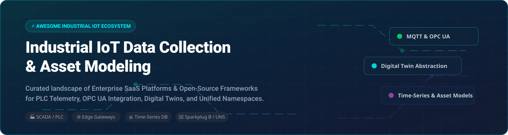

  

# 🏭 Awesome Industrial IoT Data Collection & Asset Modeling 🚀

A curated list of **commercial SaaS platforms** and **open-source GitHub software** for **Industrial IoT (IIoT)** data acquisition, PLC/SCADA telemetry extraction, hierarchical asset modeling, Digital Twins, and Unified Namespace (UNS) architectures.

---

## 📑 Table of Contents
- [🌐 Market Size & Industry Structure](#-market-size--industry-structure)
- [💼 SaaS & Commercial Platforms](#-saas--commercial-platforms)
- [🔓 Open-Source GitHub Projects](#-open-source-github-projects)
  - [⏱️ Time-Series & Data Storage](#%EF%B8%8F-time-series--data-storage)
  - [🔄 Workflow & Edge Automation](#-workflow--edge-automation)
  - [🔌 Protocol Adapters & SCADA Integration](#-protocol-adapters--scada-integration)
  - [🏢 Digital Twin & Asset Modeling Frameworks](#-digital-twin--asset-modeling-frameworks)
- [🤝 How to Contribute](#-how-to-contribute)
- [💖 Support & Sponsorship](#-support--sponsorship)
- [⚠️ Disclaimer & Operational Safety](#%EF%B8%8F-disclaimer--operational-safety)
- [⭐ Star History](#-star-history)

---

## 🌐 Market Size & Industry Structure 📊

> 📈 **Market Size**: The global **Industrial IoT (IIoT)** market size was valued at **$320 Billion in 2023** and is projected to reach **$1.1 Trillion by 2032**, expanding at a CAGR of **14.5%**. 
>
> 🧩 **Industry Structure**: The IIoT market is **moderately fragmented**. Heavyweight industrial tech conglomerates (GE, Siemens, Rockwell, AVEVA, PTC) and hyper-scaler cloud providers (AWS, Azure) hold dominant market shares in enterprise SCADA/MES and cloud IoT infrastructure. However, the ecosystem remains highly diverse with specialized edge computing vendors (Litmus) and rapid open-source innovation (Eclipse Foundation, Apache Software Foundation) filling key interoperability gaps.

---

## 💼 SaaS & Commercial Platforms 🏷️

*Industrial IoT SaaS and cloud platform offerings sorted by company size (valuation / revenue).*

| Platform 🚀 | Company Valuation / Revenue 🏢 | Starting Price 💵 | Free Tier Limit / Free Trial 🆓 | Core Strengths 💡 |
| :--- | :--- | :--- | :--- | :--- |
| **[AWS IoT SiteWise](https://aws.amazon.com/iot-sitewise/)** ☁️ | **~$1.8 Trillion** *(Amazon Market Cap)* | $0.15 / 10k messages | AWS Free Tier ($200 credits for 30 days) | Scalable AWS-native telemetry ingestion, asset hierarchy modeling, SiteWise Edge for local processing. |
| **[Siemens MindSphere](https://www.siemens.com/)** 🏭 | **~$140 Billion** *(Siemens AG Market Cap)* | ~$300 / month *(Insights Hub Starter)* | 30-day free trial with basic telemetry assets | Connects factory equipment natively to Siemens Xcelerator industrial enterprise cloud ecosystem. |
| **[GE Digital Predix](https://www.ge.com/digital/)** ⚡ | **~$200 Billion** *(GE Aerospace Market Cap)* | ~$2,000 / month *(Enterprise)* | Demo account / 30-day trial upon sales request | Enterprise asset performance management (APM) and predictive maintenance analytics for heavy industry. |
| **[Rockwell FactoryTalk](https://www.rockwellautomation.com/)** ⚙️ | **~$30 Billion** *(Rockwell Market Cap)* | ~$1,200 / year *(Per Node)* | 30-day trial for select software modules | Deep integration with Allen-Bradley PLCs, ControlLogix, and factory automation networks. |
| **[PTC ThingWorx](https://www.ptc.com/en/products/thingworx)** 🌐 | **~$21 Billion** *(PTC Market Cap)* | Quote-based (~$10,000 / year base) | No public free trial (sales-assisted POC available) | End-to-end industrial IoT app development platform with Kepware protocol integration. |
| **[AVEVA Insight](https://www.aveva.com/)** 📊 | **~$12 Billion** *(Acquired by Schneider Electric)* | ~$250 / user / month | 45-day unlimited feature free trial | Cloud-based operational intelligence, SCADA visualization, and process engineering analytics. |
| **[Cognite Data Fusion](https://www.cognite.com/)** 🧠 | **~$1.6 Billion** *(Valuation)* | Quote-based (~$2,500 / month base) | 30-day developer trial sandbox | Industrial DataOps platform for contextualizing complex engineering data and 3D digital twins. |
| **[Uptake](https://www.uptake.com/)** 🔮 | **~$1.0 Billion** *(Valuation)* | Quote-based (~$1,500 / month base) | No free tier (custom pilot program available) | AI-driven equipment health monitoring and failure prediction for energy and heavy transportation. |
| **[Sight Machine](https://sightmachine.com/)** 🤖 | **~$300 Million** *(Estimated Valuation)* | Quote-based (~$3,000 / month base) | Sales-led demo and custom POC | Real-time manufacturing data foundation converting plant-floor data into operational insights. |
| **[Litmus Edge](https://litmus.io/)** 🔌 | **~$100 Million** *(Funding / Valuation)* | $1,500 / month *(Foundation Plan)* | **Litmus Edge Developer Edition** (Free forever; full features, 2-hour session reset) | 250+ pre-built industrial drivers, edge normalization, and store-and-forward MQTT connectivity. |

---

## 🔓 Open-Source GitHub Projects 🛠️

*Popular open-source frameworks, protocol adapters, and databases sorted by stargazer popularity.*

### ⏱️ Time-Series & Data Storage

- **[InfluxDB](https://github.com/influxdata/influxdb)**  ⚡  
  **Leading open-source time-series database**, MIT licensed. Features Flux and SQL query engines, real-time downsampling, and automated data retention policies. **Best for industrial observability and telemetry data**.

- **[TDengine](https://github.com/taosdata/TDengine)**  🚀  
  **High-performance time-series data platform**, AGPL-3.0 licensed. Designed for IoT scale with built-in caching, stream processing, and ultra-high data compression ratios. **Best for high-volume sensor telemetry**.

- **[TimescaleDB](https://github.com/timescale/timescaledb)**  🐘  
  **PostgreSQL-native time-series database**, Apache-2.0 / Timescale License. Provides hypertables and SQL hyperfunctions while preserving full relational joins. **Best for teams with existing SQL workflows**.

- **[Apache IoTDB](https://github.com/apache/iotdb)**  🌴  
  **IoT-native time-series database**, Apache-2.0 licensed. Offers ultra-high ingestion throughput and tree-structured metadata management for industrial asset hierarchies. **Best for edge-to-cloud industrial time-series storage**.

### 🔄 Workflow & Edge Automation

- **[Node-RED](https://github.com/node-red/node-red)**  🔴  
  **Low-code programming for event-driven applications**, JS Foundation managed. Connects hardware devices, industrial APIs, and cloud services via a visual browser-based flow editor. **Best for rapid edge prototyping and OT/IT integration**.

- **[EdgeX Foundry](https://github.com/edgexfoundry/edgex-go)**  🧱  
  **Vendor-neutral IoT edge computing framework**, Apache-2.0 licensed (Linux Foundation project). Microservices architecture dual-interfacing edge sensors to IT/cloud infrastructure. **Best for standardized edge gateway deployments**.

- **[Apache StreamPipes](https://github.com/apache/streampipes)**  🚰  
  **Self-service industrial IoT toolbox**, Apache-2.0 licensed. Enables non-technical domain experts to connect, analyze, and explore IIoT data streams using a drag-and-drop pipeline editor. **Best for citizen data scientists in manufacturing**.

### 🔌 Protocol Adapters & SCADA Integration

- **[open62541](https://github.com/open62541/open62541)**  🔌  
  **Open-source C implementation of OPC UA (IEC 62541)**, MPL-2.0 licensed. Embedded-friendly client/server library with PubSub support. **Best for native C/C++ embedded OPC UA integration**.

- **[Apache PLC4X](https://github.com/apache/plc4x)**  🧩  
  **Universal industrial protocol adapter suite**, Apache-2.0 licensed. Provides a unified API for communicating with Modbus, Siemens S7, OPC UA, EtherNet/IP, BACnet, and Profinet. **The standard open-source library for multi-protocol PLC extraction**.

- **[Eclipse Kura](https://github.com/eclipse-kura/kura)**  🎛️  
  **OSGi-based edge gateway framework**, EPL-2.0 licensed. Manages field connectivity (Modbus, OPC UA) and cloud interfaces via a modular Java runtime. **Best for enterprise IoT edge gateways**.

- **[Eclipse Hono](https://github.com/eclipse-hono/hono)**  📡  
  **Large-scale device messaging platform**, EPL-2.0 licensed. Normalizes device connectivity over MQTT, AMQP, CoAP, and HTTP for downstream telemetry microservices. **Best for massive multi-tenant device connectivity**.

- **[Eclipse Dataspace Connector (EDC)](https://github.com/eclipse-edc/Connector)**  🔐  
  **Sovereign data sharing connector**, Apache-2.0 licensed. Implements International Data Spaces (IDS) and Gaia-X standards for trustful cross-organizational industrial data exchange. **Best for secure dataspace compliance**.

### 🏢 Digital Twin & Asset Modeling Frameworks

- **[Eclipse Ditto](https://github.com/eclipse-ditto/ditto)**  👯  
  **Production-grade Digital Twin abstraction framework**, EPL-2.0 licensed. Mirrors physical devices into stateful digital twin objects accessible via uniform REST/WebSocket APIs. **Best for enterprise digital twin state abstraction**.

- **[OpenTwins](https://github.com/ertis-research/opentwins)**  🖼️  
  **Next-generation 3D Digital Twin framework**, Apache-2.0 licensed. Integrates real-time 3D visualization (Three.js), Flink stream processing, and predictive ML models for smart plants. **Best for interactive 3D digital twins**.

- **[ThingSPIN](https://github.com/thingspin/thingspin)**  🌀  
  **NGSI-LD compliant Digital Twin platform**, open-source. Converts OPC UA data models to NGSI-LD semantic structures with RabbitMQ and Kafka messaging. **Best for semantic graph-based digital twins**.

---

## 🤝 How to Contribute 🛠️

1. 🍴 Fork this repository.
2. 📝 Add or update entries in `README.md` following the standard table/list format.
3. 🔗 Ensure all links lead directly to official product documentation or original GitHub repositories.
4. 📬 Submit a Pull Request with a short description of your addition.

---

## 💖 Support & Sponsorship ☕

Thank you for exploring this project! If you find this curated list of Industrial IoT tools, protocol adapters, and digital twin platforms helpful, please consider supporting the maintenance and growth of this resource:

- ⭐ **Star this repository** to increase its visibility for fellow OT/IT engineers.
- 🔀 **Fork and Share** it with your industrial automation community and colleagues.
- ☕ **Sponsor the developer** or buy a coffee via [GitHub Sponsors](https://github.com/sponsors/ishandutta2007).

Your support is greatly appreciated! 🙌

---

## ⚠️ Disclaimer & Operational Safety 🔒

- 🛡️ **OT Network Isolation**: Industrial control networks (ICS/SCADA) contain critical physical assets. Never expose PLC interfaces or raw industrial protocols directly to the public Internet without VPNs, zero-trust gateways, or IEC 62443 security zones.
- 📜 **Licensing Rules**: Verify software licensing (Apache-2.0, EPL-2.0, AGPL-3.0, MIT) before deploying open-source components inside proprietary manufacturing networks.

---

## ⭐ Star History

  <b>⭐ Star this repository if you find it useful for your Industrial IoT architecture! ⭐</b>

